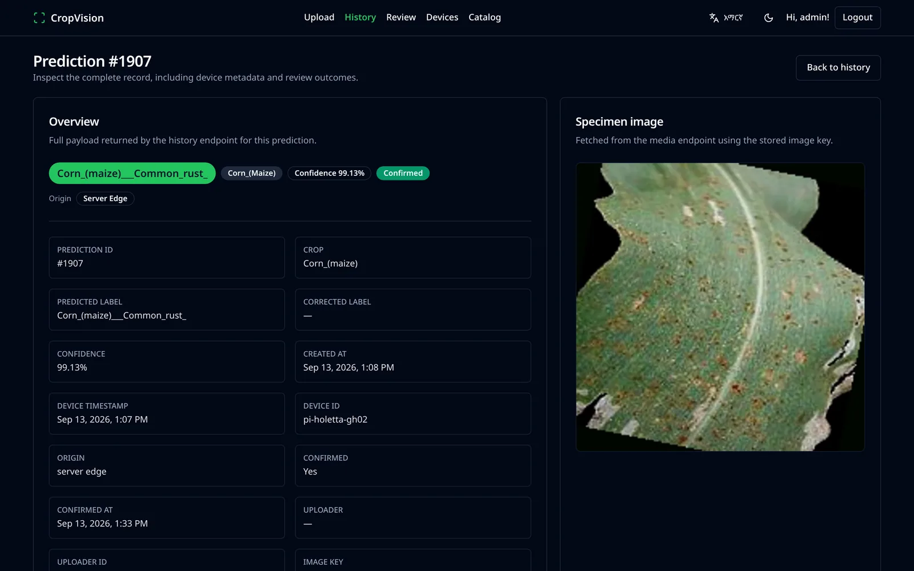
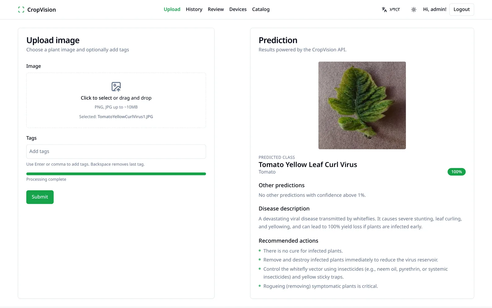
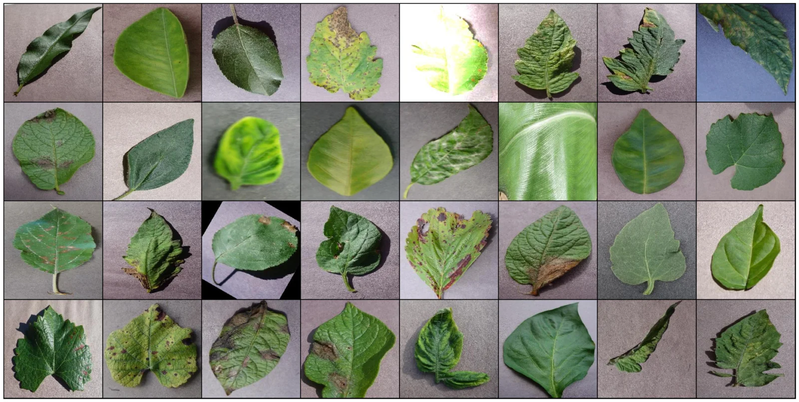
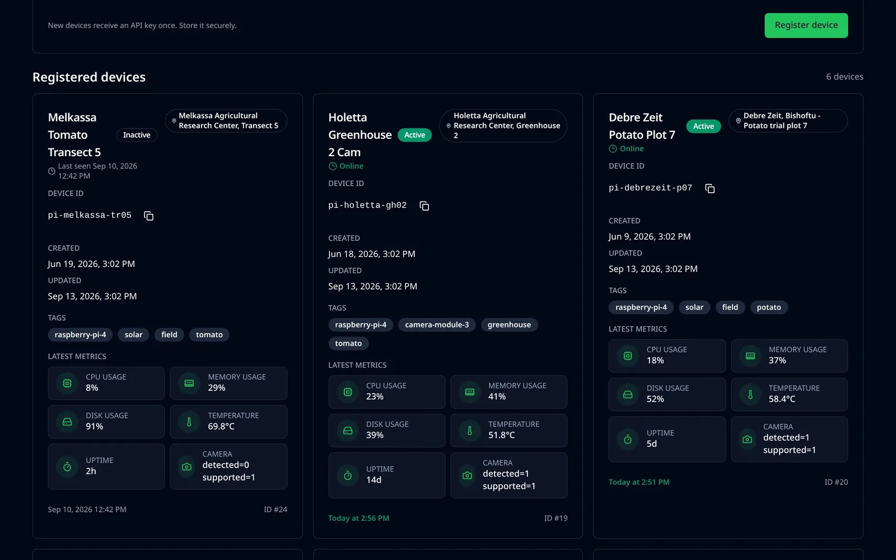

# CropVision API

**Backend service** for **CropVision**, a plant disease detection platform that pairs a self-trained PyTorch computer-vision model with a FastAPI service, and is built to run predictions both in the cloud and directly on edge hardware such as a **Raspberry Pi**.

🔗 Frontend client: [crop-vision-frontend](https://github.com/tahirmohammedaman/crop-vision-frontend)

<p align="center">
  
</p>

## At a glance

| | |
|---|---|
| **Validation accuracy** | **99.19%** on 17,572 validation images |
| **Test set** | **33 / 33** unseen leaf photos classified correctly |
| **Dataset** | [New Plant Diseases Dataset](https://www.kaggle.com/datasets/vipoooool/new-plant-diseases-dataset) — 87,867 RGB images · 38 classes · 14 crops · 26 diseases |
| **Model** | ResNet9 trained from scratch · 6.59M parameters · 256×256 RGB input |
| **Training** | 2 epochs · Adam + one-cycle learning rate · ~32 minutes on a single CUDA GPU |
| **Serving** | FastAPI + PostgreSQL · per-device API keys · Raspberry Pi edge scripts |

## What it does

Upload a photo of a plant leaf and get back the crop, the detected disease (or a healthy verdict), and a confidence score — powered by a CNN trained from random weights in this repo's notebook. Predictions are logged, searchable, and can be routed through a human review queue for low-confidence cases, which doubles as a feedback loop for the model.

<table>
  <tr>
    <td width="50%"><br><sub><b>Predict</b> — crop, disease, confidence and recommended actions from one request.</sub></td>
    <td width="50%"><br><sub><b>Review queue</b> — low-confidence predictions waiting for a human.</sub></td>
  </tr>
</table>

## The model

### Dataset

Trained on the **[New Plant Diseases Dataset](https://www.kaggle.com/datasets/vipoooool/new-plant-diseases-dataset)** on Kaggle — an offline-augmented recreation of the original **PlantVillage** dataset. It holds ~87K RGB photos of healthy and diseased crop leaves across 38 classes, split 80/20 into training and validation with the directory structure preserved, plus a separate directory of 33 test images.

| Split | Images |
|---|---|
| Train | 70,295 (1,642–2,022 per class — balanced) |
| Validation | 17,572 |
| Test | 33 |

<details>
<summary><b>All 38 classes</b> — 14 crops, 26 diseases, 12 healthy classes</summary>

| Crop | Classes |
|---|---|
| Apple | Apple scab · Black rot · Cedar apple rust · Healthy |
| Blueberry | Healthy |
| Cherry (incl. sour) | Powdery mildew · Healthy |
| Corn (maize) | Cercospora leaf spot / Gray leaf spot · Common rust · Northern leaf blight · Healthy |
| Grape | Black rot · Esca (Black measles) · Leaf blight (Isariopsis leaf spot) · Healthy |
| Orange | Huanglongbing (Citrus greening) |
| Peach | Bacterial spot · Healthy |
| Pepper, bell | Bacterial spot · Healthy |
| Potato | Early blight · Late blight · Healthy |
| Raspberry | Healthy |
| Soybean | Healthy |
| Squash | Powdery mildew |
| Strawberry | Leaf scorch · Healthy |
| Tomato | Bacterial spot · Early blight · Late blight · Leaf mold · Septoria leaf spot · Spider mites (two-spotted) · Target spot · Yellow leaf curl virus · Mosaic virus · Healthy |

</details>

<p align="center">
  
  <br><sub>One shuffled training batch of 32, straight out of the notebook's <code>DataLoader</code>.</sub>
</p>

### Architecture

A **ResNet9** written by hand in PyTorch — four convolutional blocks and two residual blocks, 6,589,734 trainable parameters:

```
input                                                 3 × 256 × 256
conv1   ConvBlock(3 → 64)                            64 × 256 × 256
conv2   ConvBlock(64 → 128)   + MaxPool(4)          128 ×  64 ×  64
res1    ConvBlock(128 → 128) × 2   ── + skip        128 ×  64 ×  64
conv3   ConvBlock(128 → 256)  + MaxPool(4)          256 ×  16 ×  16
conv4   ConvBlock(256 → 512)  + MaxPool(4)          512 ×   4 ×   4
res2    ConvBlock(512 → 512) × 2   ── + skip        512 ×   4 ×   4
head    MaxPool(4) → Flatten → Linear(512 → 38)

ConvBlock = Conv2d 3×3, padding 1 → BatchNorm2d → ReLU
```

### Training

| Hyperparameter | Value |
|---|---|
| Optimizer | Adam |
| LR schedule | One-cycle, `max_lr = 0.01` |
| Weight decay | `1e-4` |
| Gradient clipping | `0.1` (by value) |
| Batch size | 32 |
| Epochs | 2 |
| Input | 256×256 RGB, `ToTensor()` only — no normalization |
| Hardware | single CUDA GPU, 32 min 25 s wall time |

From random weights to production in two epochs:

| Epoch | Last LR | Train loss | Val loss | **Val accuracy** |
|---|---|---|---|---|
| — (random init) | — | — | 3.6378 | 2.82% |
| 0 | 0.00812 | 0.7449 | 0.7572 | 77.13% |
| 1 | 0.00000 | 0.1244 | 0.0267 | **99.19%** |

On the held-out test directory the model got **all 33 images right** — apple cedar rust and scab, corn common rust, potato early blight and healthy, tomato early blight, healthy and yellow leaf curl virus.

The API serves the same preprocessing the model was trained with (`Resize((256, 256)) → ToTensor()` in `app/services/inference.py`), so the accuracy measured in the notebook is the accuracy you get behind `/v1/predict`.

### Reproduce it

```bash
kaggle datasets download -d vipoooool/new-plant-diseases-dataset
# arrange as ./input/train, ./input/valid and ./input/test/test next to the notebook
jupyter notebook notebook/plant_disease_classifier_resnet.ipynb
```

`notebook/plant_disease_classifier_resnet.ipynb` keeps every output (plots, training log, test predictions); `plant_disease_classifier_resnet_without_output.ipynb` is the clean copy. The trained weights ship in `models/` both as a `state_dict` and as a complete pickled model.

## Features

- **Disease classification** — a custom **ResNet9** convolutional network, trained from scratch to **99.19% validation accuracy**, classifies 38 crop/disease combinations across 14 crop types.
- **Prediction history** — every inference is persisted with confidence scores, per-class probability breakdowns, tags, and source metadata, with paginated search and filtering by crop, disease, tag, date range, confidence, and origin.
- **Human-in-the-loop review** — a low-confidence review queue lets a user confirm or correct predictions, which feeds back into per-model accuracy stats.
- **JWT authentication** — user accounts secured with hashed passwords and bearer tokens.
- **Edge device fleet management** — devices are first-class citizens: register a device, issue it a scoped API key, and track its health independently of the web UI.
- **Model introspection & stats** — endpoints expose the active model's metadata and running accuracy metrics computed from confirmed/corrected predictions.
- **Dockerized & CI-checked** — ships with a `Dockerfile` and a GitHub Actions pipeline.

## Edge computing / Raspberry Pi integration

CropVision was designed to run beyond the browser — as a field-deployed sensor. The API has a dedicated device-auth layer (`X-Device-ID` / `X-Device-Key` headers, independent of user JWTs) and two companion scripts meant to run on a Raspberry Pi (or any Linux-capable single-board computer) pointed at a camera module:

- **`pi_predict_edge.py`** — captures/reads an image on the device and submits it as a registered edge device. Supports two delivery modes:
  - `server_edge` — the device sends the raw image to the API, which runs inference server-side (useful for low-power boards without a GPU).
  - `device_offline` — the device runs the model **locally** (e.g. via a distilled/quantized checkpoint) and syncs the already-computed label, confidence, and probability vector back once connectivity is available — enabling fully offline field operation.
- **`pi_heartbeat_script.py`** — a background daemon that reports device telemetry (CPU/mem/disk usage, load average, uptime, CPU temperature, and camera availability via `vcgencmd`/`libcamera`) to the API's heartbeat endpoint every 10 minutes, so device health is visible from the web dashboard without SSHing in.

Every prediction is auto-tagged with its origin (`server_web`, `server_edge`, `device_offline`) and originating device ID, so cloud-submitted and edge-submitted predictions live in the same searchable history.

<p align="center">
  
  <br><sub>The fleet as the web client sees it — heartbeat telemetry from Pis in a greenhouse and two trial plots.</sub>
</p>

## Wiring a Raspberry Pi field unit

A sample build for a self-contained field unit: a Raspberry Pi 4 with a Camera Module 3, a push button to take the photo, and an LED that says whether the prediction went through. Point it at a leaf, press the button, and the prediction shows up in History tagged with the device's ID.

<p align="center">
  
</p>

| Part | Connects to | Pi header |
|---|---|---|
| Camera Module 3 | CSI camera connector, 15-pin ribbon — contacts face the HDMI ports | — |
| Capture button, leg 1 | GPIO17 | pin 11 |
| Capture button, leg 2 | GND | pin 6 |
| Status LED, long leg (anode) | 330 Ω resistor → GPIO27 | pin 13 |
| Status LED, short leg (cathode) | GND | pin 14 |
| Power | 5 V ⎓ 3 A USB-C — mains, or a solar panel and battery bank | — |

- The button needs no resistor: `gpiozero` enables the Pi's internal pull-up, so the pin reads high until the button shorts it to ground.
- **Raspberry Pi 5** has smaller 22-pin camera connectors — use the 22-to-15-pin camera cable. The GPIO pins are the same.
- On Raspberry Pi OS (Bookworm) the camera is detected automatically; check it with `rpicam-still -o test.jpg`, then install the Python bits with `sudo apt install python3-picamera2 python3-gpiozero python3-requests python3-psutil`.
- In a field or greenhouse, keep the Pi in a ventilated enclosure out of direct sun — the heartbeat reports CPU temperature, so you'll see it on the Devices page before it throttles.

Drop this next to `pi_predict_edge.py` (with `API_URL`, `DEVICE_ID` and `DEVICE_API_KEY` filled in there):

```python
#!/usr/bin/env python3
"""field_capture.py — press the button, photograph the leaf, submit it as this edge device."""
import subprocess
import time
from pathlib import Path

from gpiozero import LED, Button
from picamera2 import Picamera2

button = Button(17, bounce_time=0.05)  # GPIO17 -> button -> GND, internal pull-up
led = LED(27)                          # GPIO27 -> 330 Ω -> LED -> GND
captures = Path.home() / "captures"
captures.mkdir(exist_ok=True)

camera = Picamera2()
camera.configure(camera.create_still_configuration(main={"size": (2304, 1296)}))
camera.start()
time.sleep(2)  # let auto-exposure settle
led.on()       # steady = ready

while True:
    button.wait_for_press()
    led.blink(on_time=0.1, off_time=0.1)  # fast blink = capturing and uploading
    image = captures / f"leaf-{time.strftime('%Y%m%d-%H%M%S')}.jpg"
    camera.capture_file(str(image))
    sent = subprocess.run(["python3", "pi_predict_edge.py", str(image), "field", "button"]).returncode == 0
    if not sent:
        led.blink(on_time=0.6, off_time=0.3, n=3, background=False)  # three slow blinks = failed
    led.on()
```

The server resizes every upload to 256×256, so a half-resolution capture is plenty. To start it on boot, run it (and `pi_heartbeat_script.py`) as systemd services:

```ini
# /etc/systemd/system/cropvision-capture.service
[Unit]
Description=CropVision capture button
After=network-online.target

[Service]
User=pi
WorkingDirectory=/home/pi/crop-vision-backend
ExecStart=/usr/bin/python3 field_capture.py
Restart=always

[Install]
WantedBy=multi-user.target
```

## Tech stack

| Layer | Technology |
|---|---|
| API framework | FastAPI (Python 3.11), Uvicorn |
| ML / inference | PyTorch, Torchvision (custom ResNet9) |
| Training | Jupyter, CUDA, Kaggle New Plant Diseases Dataset |
| Database | PostgreSQL via SQLAlchemy 2.0 |
| Auth | JWT (python-jose), Passlib, per-device API keys |
| Validation | Pydantic v2 / pydantic-settings |
| Image handling | Pillow |
| Edge scripts | Plain Python + `requests` + `psutil` (Raspberry Pi target) |
| Infra | Docker, GitHub Actions CI |

## API surface

- `POST /v1/predict` — run inference on an uploaded image (user or device auth)
- `POST /v1/devices/{id}/predictions` — sync an offline-computed prediction from a device
- `POST /v1/predictions/{id}/feedback` — confirm or correct a prediction
- `GET /v1/history`, `/v1/review/queue`, `/v1/stats`, `/v1/tags`, `/v1/crops`, `/v1/diseases`
- `POST/GET/PATCH /v1/devices`, `POST /v1/devices/{id}/heartbeat` — device fleet management
- `GET /v1/model/info` — active model metadata
- Full interactive docs at `/docs` (Swagger UI)

## Getting started

```bash
pip install -r requirements.txt
cp .env.example .env   # configure DATABASE_URL, SECRET_KEY, MODELS_PATH, etc.
uvicorn app.main:app --reload
```

Or with Docker:

```bash
docker build -t crop-vision-backend .
docker run -p 8000:8000 --env-file .env crop-vision-backend
```

The trained model weights and `model_info.json` live under `models/`; the training notebook is in `notebook/`.
